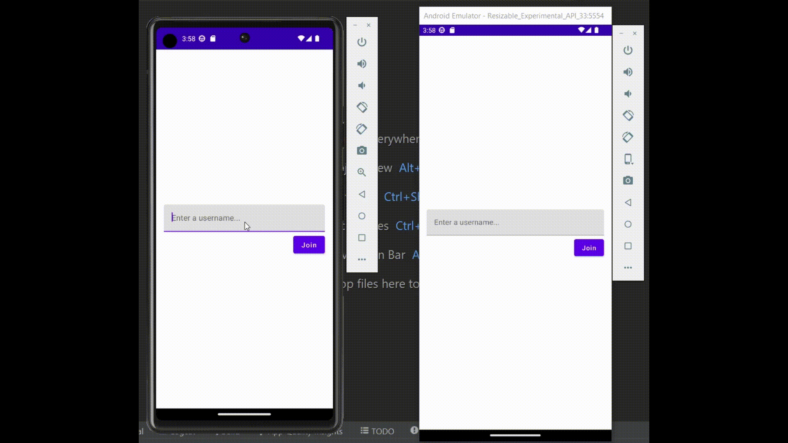

# ChatApp
This is a simple live group chat app. It allows you to chat with multiple people at the same time. The project is written using: WebSocket, Dagger Hilt, MVVM and Compose. 

The backend is written in Ktor and uses MangoDB. Here is a link to the Ktor Backend for this project: [Backend](https://github.com/ilya-shevtsov/ChatAppBackend)

***Note:*** In order for this code to work you need to replace the "localhost:8080" with your IP adress or the URL where your Ktor backend is running. 

# Demonstration

